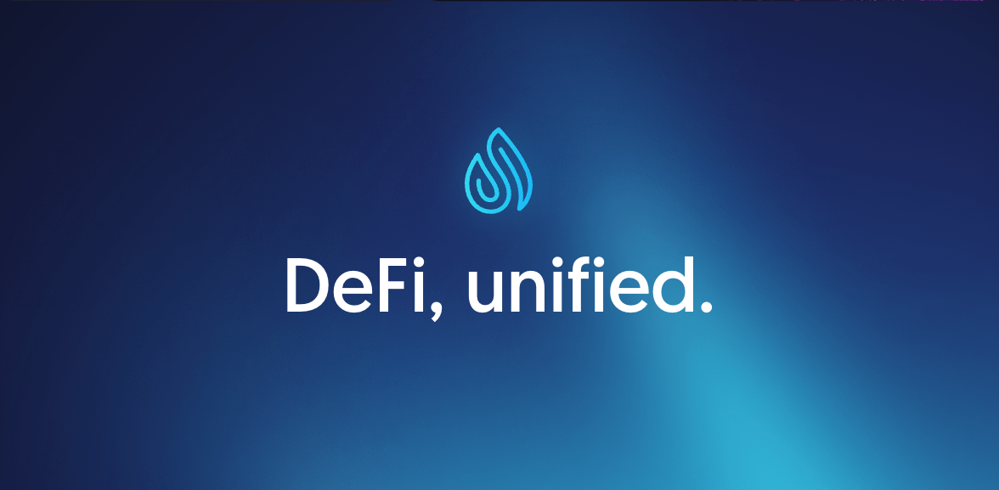

### HackaShell

> Go to to see all the projects: https://github.com/orgs/hackashell/repositories

## Description

This GitHub organization is used by Shell Protocol for hackathon purposes.

As a base layer and infrastructure for building powerful omni dapps, and composing any DeFi protocol and interactions, Shell is perfect technology for winning hackathons. 

In order to demonstrate that and onboard more builders into the Shell ecosystem, Shell Protocol engineers and Dev Rels regularly participate in hackathons, teaming up together with other hackers on the hackathons and building projects with the help of Shell.

Past hackathons and the projects and prizes won at those hackathons are listed in the [Hackathon history](#hackathon-history) section below.

Also, you can see the list of upcoming hackathons we are going to participate in the [Upcoming hackathons](#upcoming-hackathons) section below. **If you would like to team up or use Shell Protocol for your project on your own, make sure to reach out to us on our public [Discord](https://discord.com/invite/shellprotocol).**

To learn more about Shell, visit the [Shell Protocol website](https://shellprotocol.io/) and read the [Wiki page](https://wiki.shellprotocol.io/getting-started/overview). To start building, please review the [Shell developer documentation](https://docs.shellprotocol.io/).

## Hackathon history

### ETHGlobal Istanbul (17-19 Nov, 2023)
Project name: DeFi Omni Dapp

Project showcase: https://ethglobal.com/showcase/defi-omni-dapp-z8sd3

Prizes won:

- Flashbots - Best Use of UniV4 2nd Place
- Certora - Best formal specification of a project 3rd Place
- Arbitrum - Pool Prize
- Scroll - Deploy on Scroll

### ETHIndia 2023 (08-10 Dec, 2023)
Project name: Lending naan

Project showcase: https://devfolio.co/projects/lending-naan-a48f

Prizes won:
- Scroll - Deploy on Scroll

## Upcoming hackathons

TBD